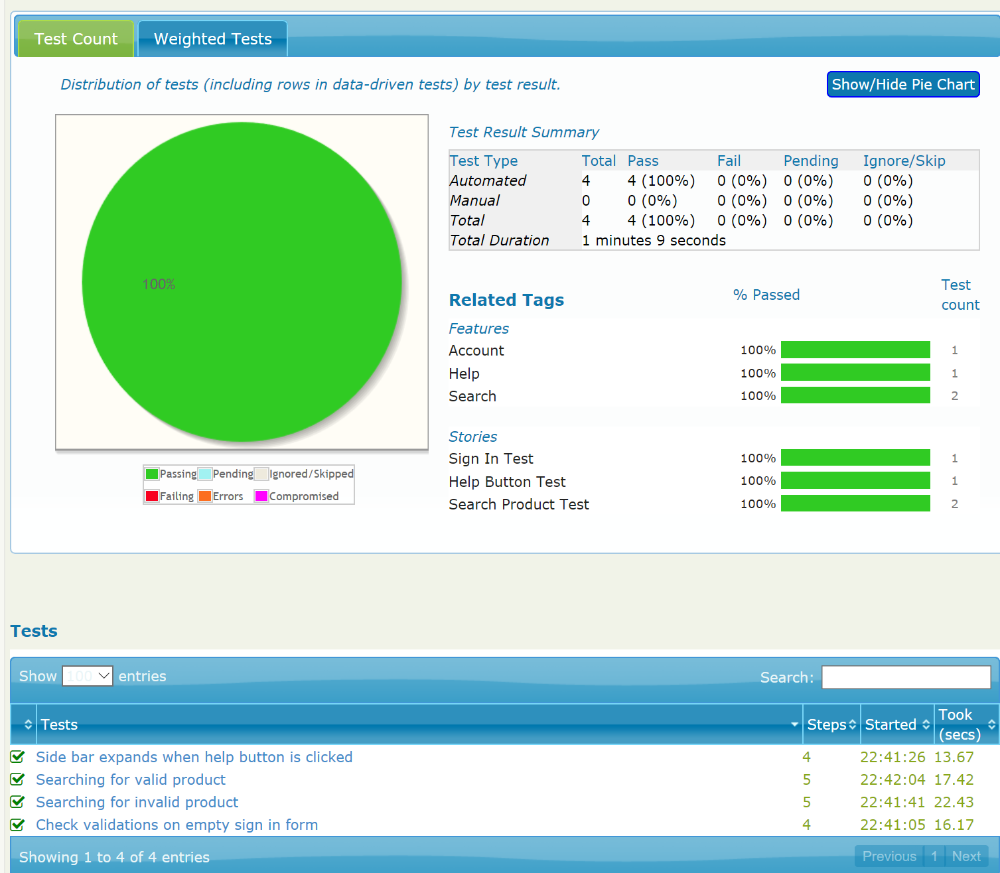

# Moo Code Tests

This Maven project uses [Serenity](http://www.thucydides.info/) with Selenium 2 and Java 1.8.

## Pre-requisites
You'll need to install the following for this project to run:
1. [Java SDK](http://www.oracle.com/technetwork/java/javase/downloads/jdk8-downloads-2133151.html)
2. [Maven](https://maven.apache.org/install.html)
3. [Chromedriver](https://chromedriver.storage.googleapis.com/index.html?path=2.32/) (if not using Windows)

## Running the tests
Run the following command where you saved a copy of this project:

`mvn clean post-integration-test`

If you are using a non-Windows OS or using your own `chromedriver`, you'll need to supply the location of your chromedriver:

`mvn clean post-integration-test -Dwebdriver.chrome.driver=<path to chromedriver>`

## Serenity Report
With Serenity, easy-to-read reports can be accessed at `/target/site/serenity/index.html`. Here's a sample screenshot of a report:
